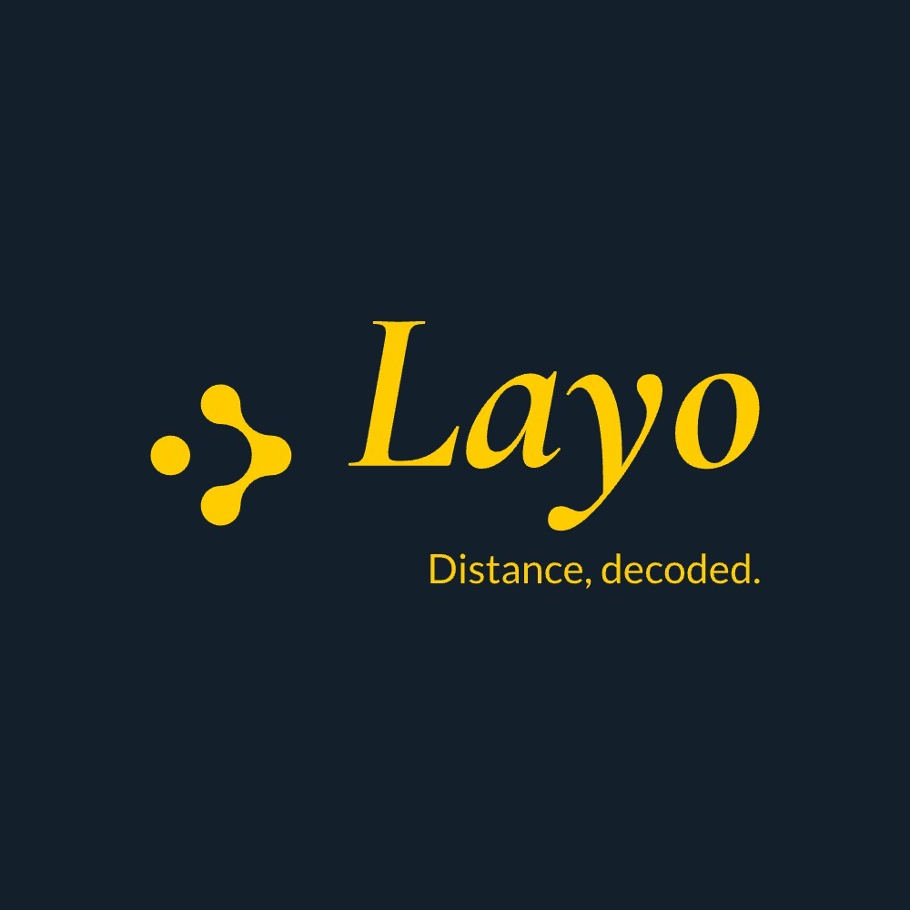
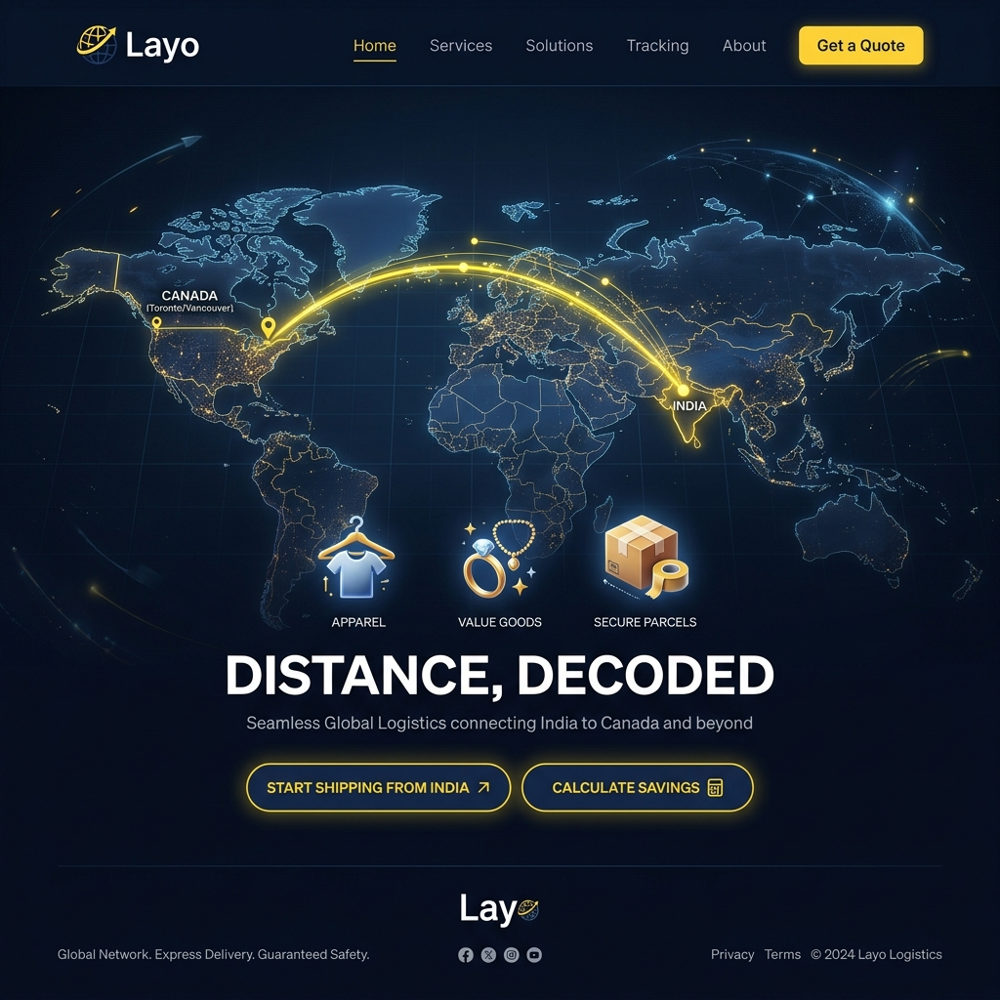
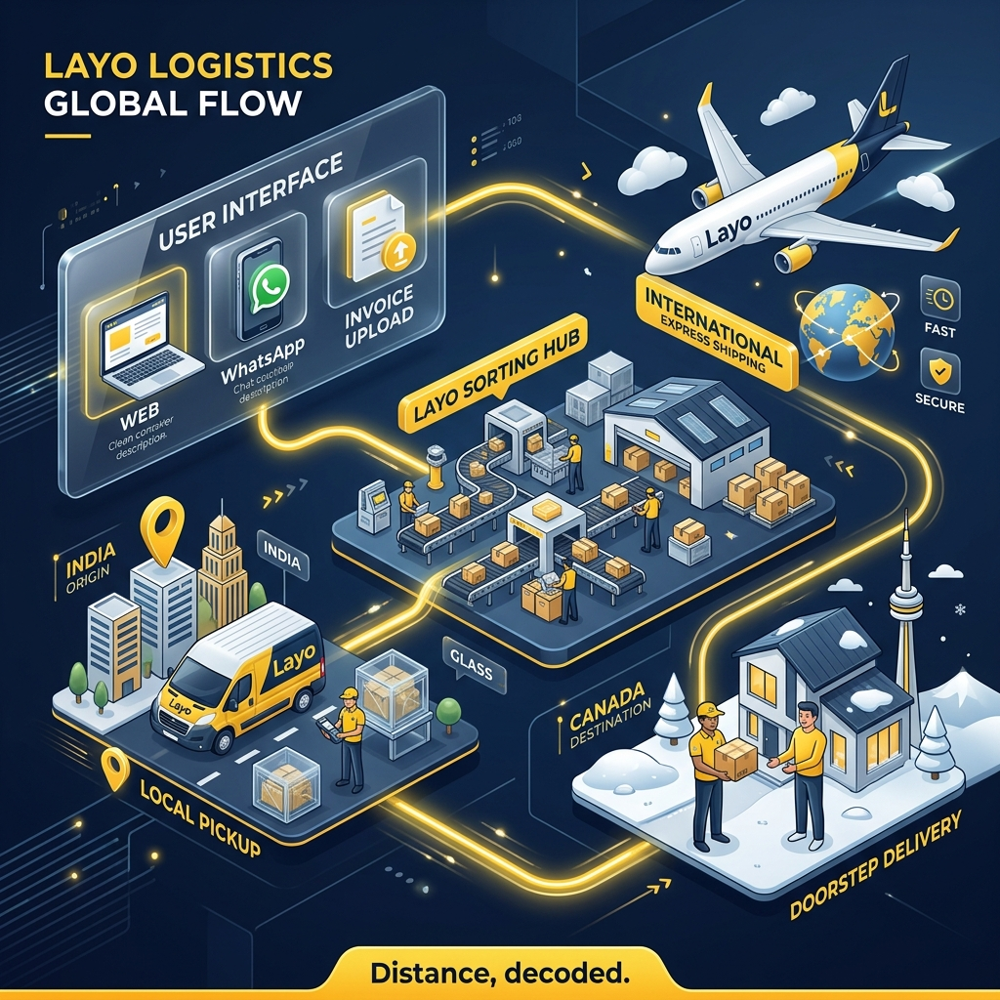

# Layo: Bridging Borders, Simplifying Logistics

## **1. Executive Summary**
Layo is a premium **logistics aggregator platform** designed to solve the significant price disparity for essential goods (specifically apparel and luxury items) between India and Canada. Layo acts as a strategic mid-player, bringing together diverse courier partners onto a single unified interface to provide seamless trans-continental delivery for Non-Resident Indians (NRIs) and customers in Canada.

---

## **2. Problem Statement**
The cost of living in Canada is significantly impacted by the high retail price of apparel and home goods.
*   **Price Inflation:** Standard clothing and household items in Canada are often **6-7 times more expensive** than the same quality products in India.
*   **Limited Variety:** NRIs often miss the cultural variety and specific quality of Indian ethnic wear, jewelry, and decor.
*   **Logistic Hurdles:** Existing international shipping options are either too expensive for individual shoppers or too complex to manage without professional assistance.

---

## **3. The Solution: Layo Platform**
Layo provides Canadians a smart aggregator platform to deliver their goods from India to Canadian doorsteps. By integrating multiple tier-1 courier partners, Layo offers a simplified user journey with three flexible options to manage shipments, ensuring optimal rates and reliability without the complexity of dealing with individual carriers.

### **Core Platform Features:**
*   **User Profiles:** Secure Sign-up and Log-in to track shipments and manage addresses.
*   **Real-time Tracking:** End-to-end visibility from India pickup to Canada delivery.
*   **Premium Interface:** A modern, intuitive dashboard designed for global users.

### **Visual Vision:**

---

## **4. Service Options**
Layo empowers customers with three distinct ways to initiate a shipment:

### **Option 1: Selection Dashboard (The "Drop-down" System)**
A simplified selection flow for customers who have the goods ready:
1.  **Address to Deliver:** Canada destination details.
2.  **Nature of Goods:** Select from categories (Clothing, Jewelry, Home Decor, Documents, etc.).
3.  **Details of Goods:** Drop-down selection for **Weight** and **Standard Box Sizes** for instant estimation.

### **Option 2: WhatsApp Integration (The "Concierge" Flow)**
*   Customers can share links or product details via a dedicated WhatsApp number.
*   Our backend team parses the information, extracts details, and automatically populates the shipment order.

### **Option 3: Digital Documentation (The "Scan & Ship" Flow)**
*   Upload the **Invoice** and **Delivery Details** (PDF/JPG).
*   Layo’s AI/manual verification team extracts the necessary customs and weight data to generate the shipping label.

---

## **5. Operational Flow: From India to Canada**
To ensure a seamless experience, Layo acts as the intelligent orchestration layer of the supply chain, partnering with established global and local courier services while maintaining rigorous quality control at every touchpoint.

---

## **6. Business Model & Value Proposition**
Even with international transportation charges, the cost-benefit for the customer is substantial.

### **Cost Comparison Example:**
| Component | Cost in India (INR) | Cost in Canada (INR) |
| :--- | :--- | :--- |
| **Product (1kg Medium Quality Cloth)** | ₹2,000 | ₹10,000 |
| **Layo Shipping Charge** | ₹3,000 | Included |
| **Total Cost** | **₹5,000** | **₹10,000** |
| **Net Savings** | **₹5,000 (50% Off)** | - |

**Benefit to User:** High-quality Indian goods at half the Canadian retail price, delivered directly to their doorstep.

---

## **7. Nature of Goods Supported**
*   **Apparel:** Ethnic wear, daily wear, designer labels.
*   **Jewelry:** Semi-precious, imitation, and certified luxury items.
*   **Home Decor:** Artifacts, linens, and handicrafts.
*   **Documents:** Critical paperwork and certificates.

---

## **8. Roadmap**
*   **Phase 1:** Launch the Web-based dashboard & WhatsApp integration.
*   **Phase 2:** Implement the automated Invoice Parsing AI.
*   **Phase 3:** Establish "Layo Hubs" in major Indian metros (Delhi, Mumbai, Bangalore) for centralized consolidation.
*   **Phase 4:** Mobile App launch (iOS & Android).

---
**Layo: Distance, decoded.**
